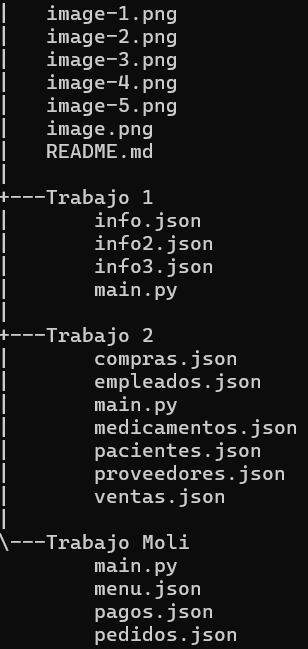
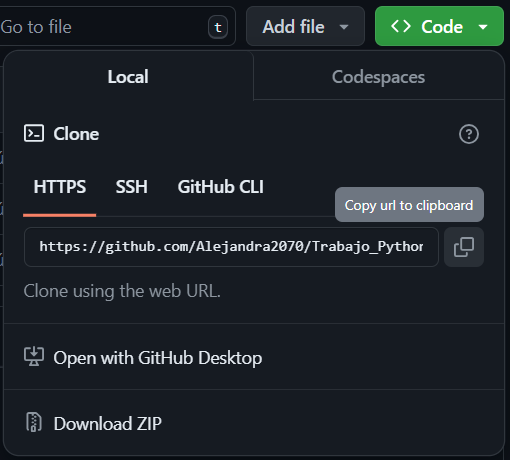
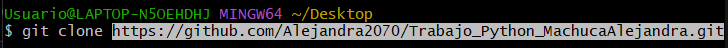
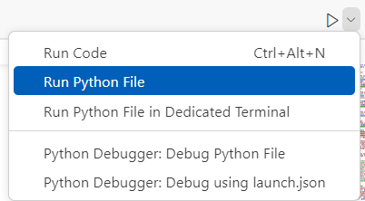

# Trabajo Python

Realización de los trabajos asignados en clase por el trainer.

## Descripción

Este repositorio cuenta con carpetas que contienen el código de los trabajos realizados.

## Tecnologías utilizadas
| Python | Json |
|--|--|
|||

## Estructura

## Características

| Nombre | Descripción |
|--|--|
| Archivos **Json** | Contienen la información necesaria para ejecutar los programas realizados. |
| Archivos **Pyhton** | En estos se encuentra el código para la creación de programas necesarios que eran solicitados para realizar los ejercicios. |

## Instrucciones

1. Copiar el enlace del repositorio.

2. Clonar el repositorio

3. Abrir el archivo

## Desarrollado por

El trabajo fue desarrollado por Alejandra Machuca, estudiante de CampusLands.