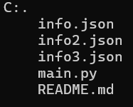

# Trabajo Python

Realización del trabajo asignado por el profesor.

## Descripción

Se creó un menú fácil de entender para los usuarios, en el que se podrán ayudar con el manejo del inventario.

## Tecnologías utilizadas
| Python |
|--|
||

## Estructura

## Características

| Nombre | Descripción |
|--|--|
| info.json | Se encuentra la información de los productos y su cantidad en stock |
| info2.json | Se encuentra la información de las ventas realizadas |
| info3.json | Se encuentra la información de las compras realizadas |
| main.py | Se encuentra el código utilizado para la realización del programa |
| README.md | Se encuentra la estructura y la explicación general del proyecto |

## Instrucciones

1. Copiar el enlace del repositorio.

2. Clonar el repositorio

3. Abrir el archivo

## Desarrollado por

El trabajo fue desarrollado por Alejandra Machuca, estudiante de CampusLands.